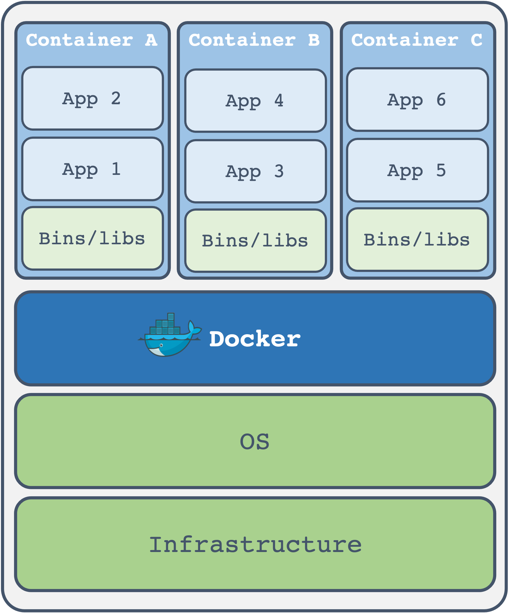

# Docker file for HVRL members
To create the docker container, please run 
```sh
cd [PATH FOR DIRECTORY]
docker image build -t [REPOSITORY NAME]:[TAG NAME] .
docker container run -itd -v $PWD:/workspace --name [IMAGE NAME] [REPOSITORY NAME]:[TAG NAME] /bin/bash
```

To run the script in docker container, please run
```sh
docker container exec -it [IMAGE NAME] bash
```

## What is Docker?

### Overview


### How to work on the machine?

1. **Sharing** the GPU/Storage of the machine
2. **Not sharing** the libraries



#### 1. Sharing the GPU/Storage of the machine
Because continers are running on the same OS/Infrastructure, they sharing the GPU and storage of the machine.
Please keep an eye on the GPU memory and the storage.

#### 2. Not sharing the libraries
Libraries are not dependent on others. Feel free to create your own environment.

## Useful Commands
Will be added soon...

## License
This repository is released under the MIT License.