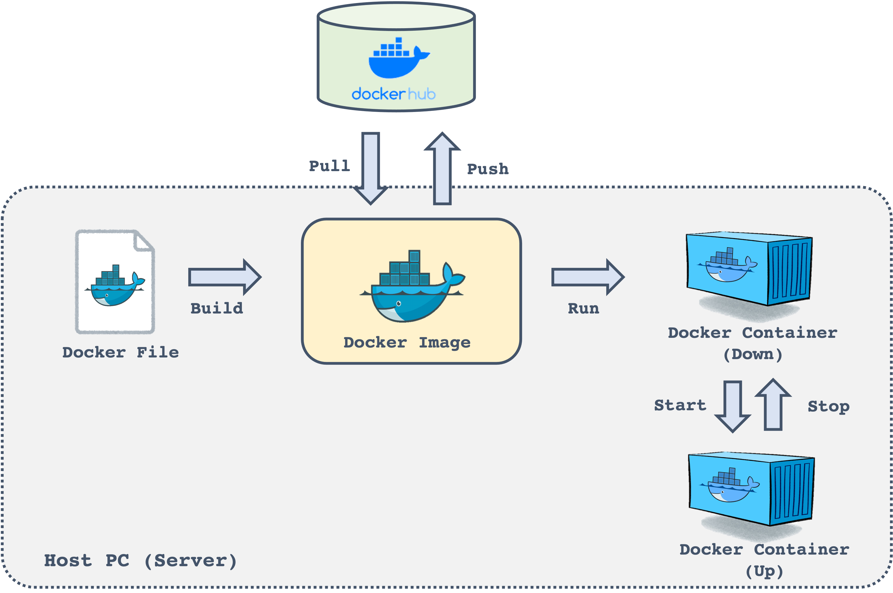

# Docker file for HVRL members
To create the docker container, please run 
```sh
cd [PATH FOR DIRECTORY]
docker image build -t [REPOSITORY NAME]:[TAG NAME] .
docker container run -itd -v $PWD:/workspace --name [IMAGE NAME] [REPOSITORY NAME]:[TAG NAME] /bin/bash
```

To run the script in docker container, please run
```sh
docker container exec -it [IMAGE NAME] bash
```

## What is Docker?

### Overview


